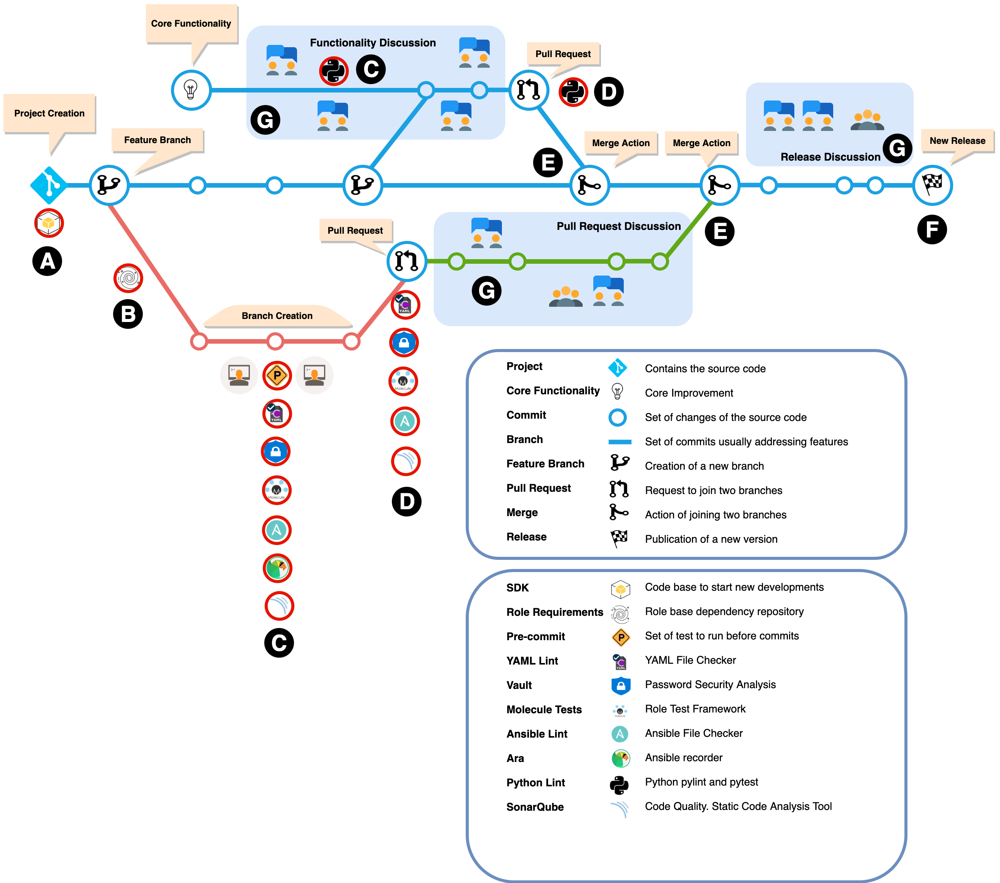
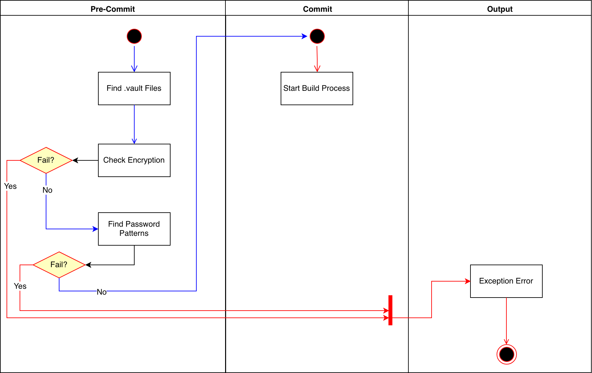
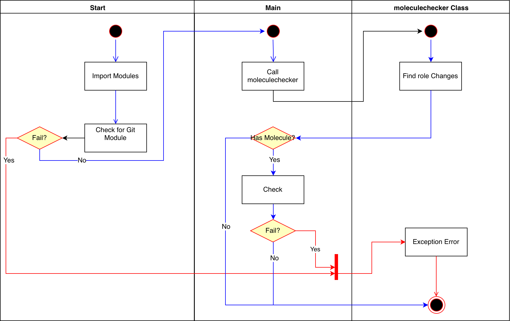

# Design Document

## 1. Introduction

**Project Name:** My Project

**Project Sponsor/ Executive:** Person1

**Infra as Code Lead:** Person2

### 1.1 Purpose of the System Design Document (SDD)

The SDD documents and tracks the necessary information required to effectively define architecture and system design in order to give the development team guidance on the architecture of the system to be developed. Design documents are incrementally and iteratively produced during the system development life cycle, based on the particular circumstances of the information technology (IT) project and the system development methodology used for developing the system.

### 1.2 Audience

The intended audience for the SDD is the project manager, project team, and the future development team. The audience or users for this system design document include the following:

* IAC Lead
* IAC Development Team

### 1.3 Background

TBD

### 1.4 Problem statement

TBD

### 1.5 Strategic Objectives

TBD

#### Table 1: Objectives

| Strategic Objectives | Measure |
|----------------------|---------|
| TBD                  | TBD     |

### 1.6 Project Topics

TBD

### 1.7 Related Projects

TBD

### 1.8 Design Constraints

#### Institutional

TBD

#### Technical

TBD

#### Financial

TBD

### 1.9 Future Contingencies

TBD

## 2. Design Guidelines

### 2.1 Stakeholder Roles/Responsibilities/Concerns

System design can cross many different groups within an organization to ensure requirements are gathered and met for all stakeholders. As such, the roles and responsibilities section may be necessary to provide the team with clarification on who performs various roles. This section also serves as a list of points of contact for the team and stakeholders should issues and concerns arise which need to be addressed.

#### 2.1.1 Technical / Project Stakeholders

The following table provides the role and contact information for the key technical and project stakeholders associated with the system design.

##### Table 2: Project members contact information

| Name    | Role               | email             |
|---------|--------------------|-------------------|
| Person1 | Executive Sponsor  | person1@email.com |
| Person2 | Infra as Code Lead | person2@email.com |

#### 2.1.2 Roles

* **Executive Sponsor**:
    1. *Approver and Sponsor* of the Solution as they will follow and approve the Solution Implementation.

* **IAC Lead**:
    1. *Managers* of the Solution as they will conduct next steps and act as referees

* **IAC Developers**:
    1. *Reviewers* of the Solution as they review code of the platform itself and ensure the quality of the solution.

#### 2.1.3 Responsabilities

* **IAC Lead**:
    1. TBD

* **IAC Developer**:
    1. TBD

#### 2.1.4 Concerns

TBD

### 2.2 Design Considerations

#### 2.2.1 Assumptions

1. TBD

#### 2.2.2 Constraints

No constraints have been detected so far as the project is very limited.

#### 2.2.3 Dependencies

The current implementation is dependent on the following technologies (Besides Ansible):

#### 2.2.3 Risks

TBD

## 3. Architecture

### 3.1 High Level Flow Diagrams

#### Components and Flow View



## 3.2 Phases

### 3.2.1 Phase _A_. SDK Installation

In the Phase A, the developer installs the Ansible SDK from the ansible-sdk repository.

Two main requirements to be able to work with the SDK:

* Having *Ansible* Installed
* Having *Molecule* Installed and therefore *CookieCutter*. Molecule will control the role tests as well as the installation of the components to be able to work with Ansible.

#### 3.2.1.1 SDK Structure

The SDK will have the following structure and it will provide automatically all the tools needed to start working with Ansible. All the tools will be fully functional and without any linter errors.

```shell
├── dev-environment
│   ├── centos7
│   ├── win2012r2
│   └── win2016
├── inventories
│   └── local
│       └── group_vars
├── playbooks
│   └── sdk
├── roles
│   └── sdk_role
│       ├── defaults
│       ├── files
│       ├── handlers
│       ├── meta
│       ├── tasks
│       ├── templates
│       ├── tests
│       └── vars
├── tests
└── vars
    └── sdk
```

1. **dev-environment**. Contains the basic Vagrant configurations to test the developments
2. **inventories**. Basic Inventories (Currently localhost, windows and linux)
3. **playbooks**. Example and fully functional playbooks
4. **roles**. Basic role that will take the name of the project automatically. Common roles will be installed here automatically with a requirements.yml file.
5. **tests**. As the SDK will not be part of a git project, linter test python programs will be installed under this directory.
6. **vars**. Fully functional vars.

For other simple tests the Docker image imjoseangel/centos7test can be downloaded. It is fully prepared and *exposed* to port 22 for SSH.

#### 3.2.1.2 SDK Installation

To install the SDK, Molecule will be used. There are two ways to automatically prepare it:

##### Using Molecule:

```bash
molecule init template --url git@github.com:imjoseangel/ansible-sdk.git
```

##### Using CookieCutter:

```bash
cookiecutter git@github.com:imjoseangel/ansible-sdk.git
```

> **Note**: **CookieCutter** is part of **Molecule** and fully supported by *Ansible* and *RedHat*.

At the time of running, it will ask some basic questions and will give some default options that, of course can be overwritten.

```shell
project_name [My Ansible SDK]: My First Project
repo_name [myansible_sdk]: my1stproject
sdk_role [myansiblerole]: my1strole
project_short_description [My Ansible Task]: This is my first project
version [0.1.0]: 1.0
```

#### 3.2.1.3 SDK Tests

As said in **SDK Structure**, some test will be prepared as the SDK will be used as a fully functional sandbox before including it in the **Ansible** Project. Lint Tests will run with the command:

```bash
python tests/test_lint.py
```

This Python will analyze whether YAML and Ansible Lints (Already installed together with *Molecule*):

```python
#!/usr/bin/env python
# -*- coding: utf-8 -*-

from __future__ import (division, absolute_import, print_function,
                        unicode_literals)
import os
import subprocess
import sys


class projectpath():
    def __init__(self):
        self.path = os.path.dirname(os.path.realpath(__file__))
        self.work_path = os.path.dirname(self.path)
        os.chdir(self.work_path)

    def dirpath(self):
        return (self.work_path)


def asterisks(title):

    rows, columns = os.popen('stty size', 'r').read().split()
    print(title, '*' * (int(columns) - int(len(title)) - 1) + '\n')


def motd():

    print("ANSIBLE STATIC TESTS")
    print("====================")
    print(" ")

    title = "[{{cookiecutter.repo_name}} Tests] "
    asterisks(title)


def main():

    motd()

    CROK = "\033[92m"
    CRFAIL = "\033[91m"
    CEND = "\033[0m"

    myproject = projectpath()
    work_path = myproject.dirpath()

    yamllint = subprocess.call(['which', 'yamllint'], stdout=subprocess.PIPE)

    ansiblelint = subprocess.call(['which', 'ansible-lint'],
                                  stdout=subprocess.PIPE)

    if yamllint == 0:

        title = "TASK [Testing YAMLLint]"
        asterisks(title)

        command = subprocess.call(['yamllint', work_path], stdin=None)
        if command == 0:
            print(CROK + "ok: [localhost] => (item=%s) \n" % work_path + CEND)
        else:
            print(CRFAIL + "fail: [localhost] => (item=%s) \n" % work_path +
                  CEND)
            sys.exit(1)
    else:
        print("Cannot find yamllint")

    if ansiblelint == 0:
        title = "TASK [Testing Ansible-Lint]"
        asterisks(title)

        for dirpath, dirnames, filenames in os.walk(work_path):
            for filename in filenames:
                if filename.endswith('.yml') or filename.endswith('.yaml'):
                    command = subprocess.call(
                        ['ansible-lint',
                         os.path.join(dirpath, filename)],
                        stdin=None)
                    if command == 0:
                        print(CROK + "ok: [localhost] => (item=%s) \n" %
                              os.path.join(dirpath, filename) + CEND)
                    else:
                        print(CRFAIL + "fail: [localhost] => (item=%s) \n" %
                              os.path.join(dirpath, filename) + CEND)
                        sys.exit(1)
    else:
        print("Cannot find ansible-lint")


if __name__ == '__main__':
    main()
```

### 3.2.2 Phase _B_. `requirements.yml` and Common Roles

A new repository called *ansible-roles-common* is needed with the following structure:

```shell
├── meta
│   └── main.yml
├── role1
├── role2
└── role*N*
```

#### 3.2.2.1 Multiple Roles Installation

This is an undocummented feature to support a `requirements.yml` file with multiple roles instead of one role, one git repository.

All the roles will be installed under the *roles* directory automatically. Be aware that a `requirements.yml` file is needed under the `roles` directory. The following command syncs the roles:

```bash
ansible-galaxy install -r roles/requirements.yml -p ./roles/ --force
```

#### 3.2.2.2 SDK Requirements Installation

Under the SDK, the role requirements have to be installed automatically. In order to do so, the `requirements.yml` will be placed under the `roles` directory. To trigger the installation, the following python code will be placed under the `hooks` directory of the project:

##### `pre_gen_project.py`

```python
#!/usr/bin/env python
# -*- coding: utf-8 -*-

from __future__ import (division, absolute_import, print_function,
                        unicode_literals)
import re
import sys


def main():

    MODULE_REGEX = r'^[-_a-zA-Z][-_a-zA-Z0-9]+$'

    repo_name = '{{ cookiecutter.repo_name }}'
    sdk_role = '{{ cookiecutter.sdk_role }}'

    if not re.match(MODULE_REGEX, repo_name):
        print('ERROR: %s is not a valid Repository Name!' % repo_name)
        sys.exit(1)

    if not re.match(MODULE_REGEX, sdk_role):
        print('ERROR: %s is not a valid Role Name!' % sdk_role)
        sys.exit(1)


if __name__ == '__main__':
    main()
```

##### `post_gen_project.py`

```python
#!/usr/bin/env python
# -*- coding: utf-8 -*-

from __future__ import (division, absolute_import, print_function,
                        unicode_literals)

import subprocess
import sys


def main():
    command = subprocess.call(
        ['ansible-galaxy', 'install', '-r', 'roles/requirements.yml'],
        stdin=None,
        stderr=subprocess.PIPE)
    if command != 0:
        sys.exit(1)


if __name__ == '__main__':
    main()
```

The `pre_gen_project.py` file will check for the right naming convention for the project and roles. The `post_gen_project.py` file will download the roles under the `roles/common` directory.

#### 3.2.2.3 Role Dependency

As the roles from the `requirements.yml` file will be installed under the `roles/common` directory, new dependencies to these roles will be added to the `meta` as:

```yaml
dependencies: [common/ansible-linux]
```

Old dependencies will be changed also to comply with the new structure.

#### 3.2.2.4 The `requirements.yml` file

The "magic" will come with both, structure and the `requirements.yml` file. This is the structure of the file:

```yaml
---
# Pull down common roles
- src: "git@github.com:imjoseangel/ansible-roles.git"
  name: common
  version: master
  scm: git
```

### 3.2.3 Phase _C_. The pre-commit and Testing Tools

Under the project, several Testing tools will be used. As it will be explained in Phase _D_, these tools will run before and after a Pull Request *(PR)*. This means that any issue with the tests will abort any PR and won't permit its completion. That's why is important understanding that tests are part of the code and need to be run in the local computer while depeloping.

#### 3.2.3.1 Pre-Commit

It hooks *git* scripts for identifying simple issues in the code that's about to be committed. We use pre-commit to Lint (See description under Linters below) our code, check the encryption of *vault* files and generate a *TODO* file for [refactoring](https://en.wikipedia.org/wiki/Code_refactoring) and avoid [technical debt](https://en.wikipedia.org/wiki/Technical_debt).

##### The `.pre-commit-config.yaml` file

This file is located in the root of every project and as noticed is a YAML file with the different tasks to run:

```yaml
---
repos:
  - repo: local
    hooks:
      - id: ansible-lint
        name: Ansible Linter
        description: This hook runs ansible-lint.
        entry: ansible-lint -x 703,701,306,301,204
        language: python
        files: \.(yaml|yml)$
      - id: python-lint
        name: Python Linter
        description: This hook runs pylint.
        entry: pylint
        language: python
        files: \.(py)$
      - id: yamllint
        name: YAML Linter
        args: ['--strict']
        entry: yamllint
        language: system
        types: [file, yaml]
      - id: ansible-vault
        name: Verify if all ansible-vault files are encrypted
        entry: python hooks/check_vault.py
        language: system
      - id: detect-secrets
        name: Detect Secrets
        description: This hook detects and prevents high entropy strings from entering the codebase
        entry: detect-secrets-hook
        language: system
      - id: techdebt
        name: Generate technical debt markdown document
        description: This hook will autogenerate a techdebt.md file
        entry: python hooks/techdebt.py -d docs
        pass_filenames: false
        always_run: true
        language: system
```

The tool has to be installed by default in the project. To install or update it manually open a console and run:

```shell
pip install --upgrade pre-commit
```

Be aware that in every repository a *requirements.txt* file is also needed for the build process. The content of the file depends on the project but at least will have the following:

```python
setuptools
ansible
detect-secrets
python-memcached
psutil
pip
netaddr
pylint
jsonschema
molecule
pre-commit
docker
GitPython
openshift
pyodbc
jmespath
pyOpenSSL
```

So doing a

```shell
pip install --upgrade -r requirements.txt
```

will do the job too to prepare the environment for the developer.

#### 3.2.3.2 YAML Static Analysis

*Linting* is the process of checking the source code for *Programmatic* as well as *Stylistic* errors. This is most helpful in identifying some common and uncommon mistakes that are made during coding. - [StackOverflow](https://stackoverflow.com/questions/8503559/what-is-linting).

*yamllint* is a tool installed with *Molecule* which does not only check for syntax validity, but for weirdnesses like key repetition and cosmetic problems such as lines length, trailing spaces, indentation, etc.

The project will have the following default configuration file:

```yaml
---
extends: default

rules:
  line-length: disable
```

But we will work on enabling the *comments-indentation* rule.

##### yamllint rules

Find the rules under the official [yamllint page](https://yamllint.readthedocs.io/en/stable/rules.html)

Line breaks in the projects are **NOT** allowed to have a more readable Ansible code. Exceptions will be reviewed and approved by the **Project Owner**.

##### yamllint False Positives

*yamllint* doesn't have *False Positives* so the rules need to be strictly followed.

#### 3.2.3.3 Python Static Testing

When developing Ansible Modules, the main language will be always Python (See below for Windows OS). There are many [linters](https://github.com/vintasoftware/python-linters-and-code-analysis) for Python but the one we use is essential and needs to be installed and enabled in our [IDE](https://code.visualstudio.com/docs/python/linting):

* pylint

#### 3.2.3.4 Python Unit Testing

Every Ansible Module needs to be developed with the [Ansible Module Development Walkthrough](https://docs.ansible.com/ansible/latest/dev_guide/developing_modules_general.html) guide in mind. **Unit Testing** will be mandatory and implemented in Git Build process.

Couple of Unit Testing Tools for Python are:

* pytest
* unitest

#### 3.2.3.5 Powershell Static Testing

For Windows Modules, Powershell is the main language. For Static Code Analysis, we need to enable *PSScriptAnalyzer* in our [IDE](https://code.visualstudio.com/docs/languages/powershell):

**Missing Task:** Implement Powershell Testing in Git.

#### 3.2.3.6 Powershell Unit Testing

Every Ansible Module needs to be developed with the [Windows Module Development Walkthrough](https://docs.ansible.com/ansible/latest/dev_guide/developing_modules_general_windows.html) guide in mind. **Unit Testing** will be mandatory and implemented in Git Build process with **Pester**.

#### 3.2.3.7 Ansible Vault Encryption Checker

A python script checks the encryption on Vault Files. Try to not use vault files as there are other better options available to manage passwords.



For unencrypted passwords in the code:

```python
(.*passw.*:|.*token.*:)[^$](?!\"{).*
```

Vault Files need to start with:

```python
\$ANSIBLE_VAULT;\d\.\d;\w+
```

##### Code

```python
#!/usr/bin/env python
# -*- coding: utf-8 -*-
# pylint: disable=missing-docstring

from __future__ import (division, absolute_import, print_function,
                        unicode_literals)
import os
import sys
import re


class WorkPath():  # pylint: disable=too-few-public-methods
    def __init__(self):
        self.path = os.path.dirname(os.path.realpath(__file__))
        self.work_path = os.path.dirname(self.path)
        os.chdir(self.work_path)

    def dirpath(self):
        return self.work_path


def main():

    cr_fail = "\033[91m"
    c_end = "\033[0m"

    # Sets default exit status code
    return_code = 0

    myproject = WorkPath()
    work_path = myproject.dirpath()

    vaultpattern = re.compile(r"\$ANSIBLE_VAULT;\d\.\d;\w+")

    for dirpath, _, filenames in os.walk(work_path):
        for filename in filenames:
            if filename.endswith('.vault'):
                vaultfile = open(os.path.join(dirpath, filename), 'r')
                vaulthead = vaultfile.readline()
                vaultfile.close()
                isvault = re.findall(vaultpattern, vaulthead)
                if not isvault:
                    print(cr_fail +
                          "fail: [Unencrypted Vault] => (item=%s) \n" %
                          os.path.join(dirpath, filename) + c_end)
                    return_code = 1

    sys.exit(return_code)


if __name__ == '__main__':
    main()
```

#### 3.2.3.8 Ansible Static Testing

*ansible-lint* is also a tool installed with *Molecule* (See below). This tool checks playbooks for practices and behaviour that could potentially be improved.

##### ansible-lint Rules

**ANSIBLE0002:** *Trailing whitespace*
  There should not be any trailing whitespace
**ANSIBLE0004:** *Git checkouts must contain explicit version*
  All version control checkouts must point to an explicit commit or tag, not just "latest"
**ANSIBLE0005:** *Mercurial checkouts must contain explicit revision*
  All version control checkouts must point to an explicit commit or tag, not just "latest"
**ANSIBLE0006:** *Using command rather than module*
  Executing a command when there is an Ansible module is generally a bad idea
**ANSIBLE0007:** *Using command rather than an argument to e.g. file*
  Executing a command when there is are arguments to modules is generally a bad idea
**ANSIBLE0008:** *Deprecated sudo*
  Instead of sudo/sudo_user, use become/become_user.
**ANSIBLE0009:** *Octal file permissions must contain leading zero*
  Numeric file permissions without leading zero can behave in unexpected ways. See [File Module](http://docs.ansible.com/ansible/file_module.html).
**ANSIBLE0010:** *Package installs should not use latest*
  Package installs should use state=present with or without a version
**ANSIBLE0011:** *All tasks should be named*
  All tasks should have a distinct name for readability and for --start-at-task to work
**ANSIBLE0012:** *Commands should not change things if nothing needs doing*
  Commands should either read information (and thus set changed_when) or not do something if it has already been done (using creates/removes) or only do it if another check has a particular result (when)
**ANSIBLE0013:** *Use shell only when shell functionality is required*
  Shell should only be used when piping, redirecting or chaining commands (and Ansible would be preferred for some of those!)
**ANSIBLE0014:** *Environment variables don't work as part of command*
  Environment variables should be passed to shell or command through environment argument
**ANSIBLE0015:** *Using bare variables is deprecated*
  Using bare variables is deprecated. Update your playbooks so that the environment value uses the full variable syntax ("{{your_variable}}").
**ANSIBLE0016:** *Tasks that run when changed should likely be handlers*
  If a task has a `when: result.changed` setting, it's effectively acting as a handler
**ANSIBLE0017:** *become_user requires become to work as expected*
  become_user without become will not actually change user
**ANSIBLE0018:** *Deprecated always_run*
  Instead of always_run, use check_mode.

> **Note**: These are the defaults but new rules will be added gradually and documented as needed.

##### ansible-lint False Positives

If there is a false positive, use `skip_ansible_lint` tag with any task that you want to skip.

```yaml
- name: My Ansible Job
  module:
    args: myargs
  tags:
    - skip_ansible_lint
```

#### 3.2.3.9 Molecule - Ansible Unit Testing

Unit testing in Ansible is key to making sure roles function as intended. Molecule makes this process easier by allowing you to specify scenarios that test roles against different environments. Molecule provides support for testing with multiple instances, operating systems and distributions, virtualization providers, test frameworks and testing scenarios.

Molecule is part of the [Ansible Project](https://github.com/ansible/molecule) and therefore having official support from RedHat.

**Molecule** is automatically added to the Project after running the *requirements.txt*, but to install and upgrade it run:

```shell
pip install --upgrade molecule
```

##### Preparing a role for Molecule Testing

Under the Ansible SDK, go inside the role you want to initialize for Molecule and run:

```bash
molecule init scenario -r ansible-setup-sdk -d [vagrant|docker|azure] --verifier-name ansible
```

*Vagrant* is recommended for Full Tests and it will run full VMs under VirtualBox automatically. Docker is recommended for quick tests.

For Git, Azure has to be considered and **Tested** as CI Build Option and **it is an important part for the Quality Gates of this project**.

##### Default Vagrant Configuration

The default Vagrant Configuration has an Ubuntu Xenial Box. For Windows, the configuration is quite more complicated and needs to be polished, although a fully functional box is available at [Github](https://github.com/imjoseangel/molecule-vagrant).

It needs custom `create.yml` and `destroy.yml` files and the `molecule.yml` file will be like this:

```yaml
---
dependency:
  name: galaxy
driver:
  name: vagrant
  provider:
    name: virtualbox
lint:
  name: yamllint

platforms:

  - name: centos
    box: bento/centos-7.5
    groups:
      - linux

  - name: vagrant-2012r2
    box: adaptiveme/windows2012r2
    memory: 4096

provisioner:
  name: ansible
  inventory:
    host_vars:
      vagrant-2012r2:
        ansible_become: false
        ansible_user: vagrant
        ansible_password: vagrant
        ansible_port: 55985
        ansible_host: 127.0.0.1
        ansible_connection: winrm
        ansible_winrm_scheme: http
        ansible_winrm_server_cert_validation: ignore
    group_vars:
      linux:
        ansible_become: true
  lint:
    name: ansible-lint

scenario:
  name: default
  converge_sequence:
    - create
    - converge

verifier:
  name: testinfra
  lint:
    name: flake8
```

##### Running Molecule

In order to test our roles, just run inside the role:

```shell
molecule test
```

##### Molecule on Git

Molecule needs to be implemented on Git as a CI Build Process. See below for more information about how to implement it and what are the pending tasks for this project.

###### Molecule PIP Dependencies

In order to have Molecule integrated with Docker, Vagrant and Azure respectively, different *pip* extra packages need to be installed:

```bash
pip install --upgrade python-vagrant docker ansible[azure]
```

#### 3.2.3.10 Detect-Secrets Password Detector

To detect and prevent high entropy strings from entering in the codebase, we use detect-secrets solution from [Yelp.com](https://github.com/Yelp/detect-secrets).

It:

1. Prevents new secrets from entering the code base,
2. Detects if such preventions are explicitly bypassed, and
3. Provides a checklist of secrets to roll, and migrate off to a more secure storage.

To install:

```shell
pip install --upgrade detect-secrets
```

#### 3.2.3.10 Lint Checker

Lint checker is a tool developed in Python to unify all the checks during the build process. It reads a *.ini* file with all the checks. This tool only checks the files changed in a given PR and not the whole repository.

```python
#!/usr/bin/env python
# -*- coding: utf-8 -*-
"""Checks Linters over all the ansible files found"""

from __future__ import (division, absolute_import, print_function,
                        unicode_literals)
import importlib
import os
import sys
import subprocess
import configparser
import ast
import re

try:
    importlib.import_module('git')
    import git
except ImportError:
    print("GitPython is not installed")
    sys.exit(1)


class WorkPath:
    """ WorkPath Class """
    def __init__(self):
        self._path = os.path.dirname(os.path.realpath(__file__))
        self.repo = git.Repo(search_parent_directories=True)
        self._work_path = self.repo.git.rev_parse("--show-toplevel")
        os.chdir(self._work_path)
        self._config = configparser.ConfigParser()
        self._config.read(self._path + '/{0}'.format('lint_checker.ini'))
        if 'branch' in self._config['DEFAULT']:
            self.branch = self._config['DEFAULT']['branch']
        else:
            self.branch = 'devel'

    def workpath(self):
        """ Return Work Path """
        return self._work_path

    def path(self):
        """ Returns Path """
        return self._path

    def config(self):
        """ Returns Path """
        return self._config

    def __gitdownload(self):

        for item in self.repo.index.diff('origin/{0}'.format(self.branch)):
            if item.a_blob is not None:
                yield item.a_path

    def getchanges(self):
        """ Returns Git Changes """

        changes = list(self.__gitdownload())
        return changes


def asterisks():
    """ Show Line """

    print('=' * int(78))


def runlinter(binary, args, file):
    """ Run Specific Linter """
    try:

        lint_proc = subprocess.Popen(binary + ' ' + args + ' {0}'.format(file),
                                     shell=True,
                                     executable="/bin/bash",
                                     stdin=None,
                                     stdout=subprocess.PIPE,
                                     stderr=subprocess.STDOUT)
        lint_proc.wait()

        return lint_proc

    except subprocess.CalledProcessError as exception:
        print(exception.output)
        sys.exit(1)


def getruninfo(runprocess, score):
    """ Get Return Code for the Process """
    runinfo_rc = 0

    for line in iter(runprocess.stdout.readline, b''):
        if score:
            linter_score = re.search(r"(?P<score>\d?\d\.\d\d)",
                                     line.decode('UTF-8'))
            if linter_score:
                print(line.decode('UTF-8'))
                rate = float(linter_score.group('score'))
            else:
                rate = float(10.0)

            if rate < 9.0:
                runinfo_rc = 1

        else:
            print(line.decode('UTF-8'))

            if runprocess.returncode > 0:
                runinfo_rc = 1

    return runinfo_rc


def main():
    """ Main Function """

    # Sets default exit status code
    return_code = 0

    myproject = WorkPath()
    project_changes = myproject.getchanges()
    work_path = myproject.workpath()
    config_file = myproject.config()
    config_sections = config_file.sections()

    for filename in project_changes:
        for section in config_sections:
            try:
                extensions = ast.literal_eval(config_file.get(
                    section, "files"))
            except ValueError:
                print('Error reading extensions, please be sure it is a list')
            if filename.endswith(tuple(extensions)):
                file = os.path.join(work_path, filename)

                print("[{0}] Filename: {1}".format(section, file))
                asterisks()

                try:
                    binary = config_file[section]['binary']
                except KeyError:
                    print(
                        'Cannot read binary section, please be sure it exists')

                try:
                    args = config_file[section]['args']
                except KeyError:
                    args = ''

                try:
                    score = config_file[section]['score']
                except KeyError:
                    score = None

                run_linter = runlinter(binary, args, file)
                lintruninfo = getruninfo(run_linter, score)

                if lintruninfo == 1:
                    return_code = 1

    sys.exit(return_code)


if __name__ == '__main__':
    main()
```

The *.ini* file looks like:

```ini
[DEFAULT]
branch = master

[yamllint]
description = Runs yamllint for yaml files
files = ['yml', 'yaml']
binary = yamllint
args = --strict

[ansiblelint]
description = Runs ansiblelint for yaml files
files = ['yml', 'yaml']
binary = ansible-lint
args = -R --force-color -x 703,701,306,301,204

[pylint]
description = Runs pylint for python files
files = ['py']
binary = pylint
score = 9.0

[vault]
description = Checks security for vault files
files = ['vault']
binary = python
args = ./hooks/check_vault.py

[detect-secrets]
description = Detects and prevents high entropy strings from entering the codebase
files = ['']
binary = detect-secrets-hook
```

#### 3.2.3.11 EditorConfig

EditorConfig helps maintain consistent coding styles for multiple developers working on the same project across various editors and IDEs. The EditorConfig project consists of a file format for defining coding styles and a collection of text editor plugins that enable editors to read the file format and adhere to defined styles. EditorConfig files are easily readable and they work nicely with version control systems.

The *.editorconfig* used for Ansible:

```ini
# EditorConfig is awesome: http://EditorConfig.org

# top-most EditorConfig file
root = true

# Unix-style newlines with a newline ending every file
[*]
charset = utf-8
end_of_line = lf
insert_final_newline = true
trim_trailing_whitespace = true

[*.{py,rst,ini}]
indent_style = space
indent_size = 4

[*.{yml,yaml}]
indent_style = space
indent_size = 2

```

#### 3.2.3.12 Ansible ARA - On Development

The Ansible Run Analysis tool integrates seamlessly with Ansible, offering a simple, intuitive way to find the data you need. The Ansible Run Analysis (ARA) tool makes this verbose output readable and more representative of the job status and debug information. ARA organizes recorded playbook data so you can search and find what you’re interested in as quickly and as easily as possible. The scope of ARA is comparatively narrow: It records data and provides an intuitive interface.

To install **ara** do:

```shell
pip install --upgrade ara[server]
```

To configure, run:

```shell
python -m ara.setup.ansible
```

and add the output to your ansible.cfg in your sandbox. The final ansible.cfg should looks like:

```yaml
[defaults]
host_key_checking   = False
retry_files_enabled = False

inventory        = inventories/local/hosts
lookup_plugins   = plugins/lookup
filter_plugins   = plugins/filter
roles_path       = roles
library          = library

transport        = smart
gathering        = smart

hash_behaviour = merge

ansible_managed = This file is managed by Ansible.%n
  template: {file}
  date: %Y-%m-%d %H:%M:%S
  user: {uid}
  host: {host}

stdout_callback = yaml

callback_plugins = ~/ansible/lib/python3.7/site-packages/ara/plugins/callback
action_plugins   = ~/ansible/lib/python3.7/site-packages/ara/plugins/action

[ssh_connection]
ssh_args = -o StrictHostKeyChecking=no
```

##### Running ARA WebServer

Running the ARA webserver will show the log of the run tasks to easily debug them in our sandbox. To start it run:

```shell
ara-manage migrate
ara-manage runserver
```

And point your browser to **localhost:8080**. The default configuration will be saved under *~/.ara* directory.

#### 3.2.3.13 Other Static Code Testing - Bash Scripting - Development Environment

In some cases, a quick bash script can solve a issue in our dev environment. We recommend the use of shellcheck and install the VSCode Plugin for Shell Scripting Static Testing.

### 3.2.4 Phase _D_. The Azure DevOps Agent and Build Testing Tools

When creating a PR, the quality gates need to be added to Azure DevOps. Azure DevOps will need an Agent that will automatically run the same **Pre-Commit** tools on every commit. PRs will be automatically discarded if the Build is unsuccessful.

#### 3.2.4.1 Basic Tools - First Phase

In a first phase, the following tools need to be implemented:

* Azure DevOps Agent
* YAMLLint
* ansible-lint
* pylint
* detect-secrets
* Vault Checker
* Configuration as Code

#### 3.2.4.2 Azure DevOps Agent and Configuration as Code

We need Azure Agents available for Builds and Deployments.

Once installed, we need to create a file called *azure-pipelines.yml* in the root of the Project:

```yaml
---
trigger:
  branches:
    exclude:
      - '*'

pool:
  vmImage: 'MyPool'

steps:

  - task: UsePythonVersion@0
    inputs:
      versionSpec: '3.7'
      addToPath: true

  - script: pip install -r requirements.txt
    condition: succeeded()
    displayName: Install Python PIP Packages

  - task: PythonScript@0
    inputs:
      scriptSource: filePath
      scriptPath: hooks/lint_checker.py
      pythonInterpreter: python3.7
    condition: succeeded()
    displayName: Lint Checker

```

#### 3.2.4.2 Molecule under Azure DevOps

In order to implement Molecule in Azure DevOps, a new Python Code is needed with the following flow:



The code prepared is (To be improved):

```python
#!/usr/bin/env python
# -*- coding: utf-8 -*-

from __future__ import (division, absolute_import, print_function,
                        unicode_literals)
import imp
import os
import re
import subprocess
import sys

try:
    imp.find_module('git')
    import git
except ImportError:
    print("GitPython is not installed")
    sys.exit(1)


class moleculechecker():
    def __init__(self):
        self.path = os.path.dirname(os.path.realpath(__file__))
        self.work_path = os.path.dirname(self.path)
        os.chdir(self.work_path)

    def dirpath(self):
        return (self.work_path)

    def __gitdownload(self):

        self.dirpath()
        repo = git.Repo()
        for item in repo.index.diff('origin/develop'):
            yield item.a_path

    def getroles(self):

        directories = list(self.__gitdownload())

        r = re.compile("roles/(.+?)/")
        newlist = set(list(filter(r.match, directories)))

        for item in newlist:
            roles = re.search(r"roles\/(.+?)\/", item)
            yield roles.group(1)


def main():
    getroles = moleculechecker()
    roles = (list(set(getroles.getroles())))
    work_path = getroles.dirpath()

    for role in roles:
        if os.path.exists(work_path + "/roles/%s/molecule" % role):
            os.chdir(work_path + "/roles/%s" % role)
            ansible_env = os.environ.copy()
            ansible_env[
                "ANSIBLE_VAULT_PASSWORD_FILE"] = "/etc/ansible/.vault.pw"
            command = subprocess.call(['molecule', 'check'],
                                      stdin=None,
                                      env=ansible_env,
                                      stderr=subprocess.PIPE)
            if command != 0:
                sys.exit(1)
        else:
            pass


if __name__ == '__main__':
    main()
```

It will check only those roles with molecule tests added (This will be mandatory in the future):

```yaml
  - phase: Molecule
    queue: MyQueue
    steps:

      - checkout: self
        clean: true

      - task: UsePythonVersion@0
          inputs:
          versionSpec: '3.7'
          addToPath: true

      - script: pip install -r requirements.txt
          condition: succeeded()
          displayName: Install Python PIP Packages

      - task: PythonScript@0
        inputs:
          targetype: filePath
          scriptPath: hooks/check_molecule.py
        condition: succeeded()
        displayName: Molecule
```

##### Next Phase - Windows and Linux Molecule Testing

Molecule on Azure test are though for Linux deployments, although PaaS and Windows are also possible.

### 3.2.5 Phase _E_ and _F_. Merge and Release

In both cases, same Quality Gates applied in Phase _D_ will be configured. No Merge or Release will be successful if some of the Lint fail for some specific reason. This redundancy on tests, will ensure the quality of our code.

### 3.2.6 Phase _G_. Team Discussions

The most important part of **DevOps** is keeping discussions alive for code implementations, issues and releases.

It is also mandatory for **every functionality** having a design and discuss it and approved by the with the whole team

In case of exceptions, it will be approved by the **whole team**.

#### 3.2.6.1 Way of Working and Best Practices

There are several best practices to follow flexibly and that can start with the following points. Of course this list can be ammended to be successful in any single written piece of code:

The main points are:

* Any code with Lint errors (Ansible, Python, Powershell, etc) won’t be accepted in any case.
* We will always use Ansible Modules. If not available we will develop them following the Ansible standards. The **Main Logic** will check only the idempotency of the action.
* We have follow the must of one Module, one Functionality.
* We have follow the must of one Role, one Functionality.
* We will focus in the main functionality and the deliverables stated on the Design, thinking in the whole project but not going out of the boundaries.
* Any blocker or issue to develop a functioanlity, **discuss with the Team**.
* Playbooks will orchestrate only. **Inventory <-> Playbook <-> Role**
* Every single piece of code released in **Dev** and **Master** will be fully functional and final.
* Every single piece of code released in **Dev** and **Master** will be fully tested.
* **Every Functionality will have a design and will be discussed by the whole team.**
* Every role will have test and won’t be accepted unless **discussed by the whole team**.
* Every New Module developed will have acceptance test, documentation and will be compatible with Python 2 and 3.
* **Modules** need to be reviewed to comply with above statements. d
* Everything will be automated. Manual changes to an implementation are not allowed. Our code needs to be idempotent.
* No **hardcoded variables** are allowed. We need to automate everything and find the right patterns.
* Create a readable code, use good names for the variables. “{{ dockerpath }}” is better than “{{ var1 }}”. for number in bingolist is better than for i in j (See also bullet 2)
* Document Everything
* Avoid Obvious Comments
* If the code is not in the repositories (QG, Approvals, PR, etc), it doesn’t exist.
* **DRY** Principle (Don't Repeat Yourself). The same piece of code should not be repeated over and over again.
* Add TODOs for Refactoring

#### 3.2.6.2 Developer and Style Guide

Follow the Style Guides together with this document as well as the [Ansible Developer Guide](https://docs.ansible.com/ansible/latest/dev_guide/index.html) and the [Ansible Style Guide](https://docs.ansible.com/ansible/latest/dev_guide/style_guide/index.html).

### 4.1 Ansible Framework and Structure

### 4.1.1 Directory Structure

```shell
├── inventories
│   └── local
│       └── hosts
├── library
│   └── mymodule.py
├── playbooks
│   ├── myobject
│   │   └── myplaybook.yml
│   └── pretasks.yml
├── roles
│   └── myrole
│       ├── defaults
│       │   └── main.yml
│       ├── files
│       ├── handlers
│       ├── meta
│       ├── molecule
│       ├── tasks
│       │   ├── main.yml
│       │   ├── action.yml
│       │   └── anotheraction.yml
│       ├── handlers
│       ├── templates
│       ├── tests
│       └── vars
│           └── main.yml
└── vars
    ├── global
    │   └── common.yml
    ├── dev
    │   └── common.yml
    ├── tst
    │   └── common.yml
    ├── acc
    │   └── common.yml
    └── prd
        └── common.yml
```

### 4.1.2 ansible.cfg

The *ansible.cfg* file for the project will looks like:

```ini
[defaults]
host_key_checking   = False
retry_files_enabled = False

inventory        = inventories/local/hosts
library          = library
callback_plugins = plugins/callback
lookup_plugins   = plugins/lookup
filter_plugins   = plugins/filter
roles_path       = roles

transport        = smart
gathering        = smart

hash_behaviour = merge

ansible_managed = This file is managed by Ansible.%n
  template: {file}
  date: %Y-%m-%d %H:%M:%S
  user: {uid}
  host: {host}

stdout_callback = yaml

jinja2_native=true

[ssh_connection]
ssh_args = -o StrictHostKeyChecking=no
```

#### 4.1.3 Inventory

To start with Ansible a simple inventory is recommended. All the project will start with this inventory structure:

.
└── inventories
    └── local
        └── hosts

where the hosts file is:

```ini
[local]
localhost ansible_connection=local ansible_python_interpreter='/usr/bin/env python3'
```

For complex inventories, we have to use dynamic inventories from a single source of truth (SSOT). every data element is mastered (or edited) in only one place. SSOT systems provide data that are authentic, relevant, and referable.

#### 4.1.4 Playbooks

All the playbooks will have the same structure for better reading. The structure is the following:

```yaml
---
- name: Playbook Schema
  hosts: localhost
  connection: local
  gather_facts: false

  pre_tasks:

    - name: Set global fact for base dir
      set_fact:
        play_dir: "{{ playbook_dir | dirname }}"

    - name: Assert variables
      assert:
        that: "{{ item }} is defined"
        msg: "{{ item  }} is not defined"
      loop:
        - env

    - name: Include pre-tasks
      include_tasks: "{{ play_dir }}/pretasks.yml"

  tasks:
    - name: Let's call a role
      include_role:
        name: ansible-role
      vars:
        action: deploy
        ansiblerolevar: rolevar
```

##### 4.1.4.1 The Pre-Tasks Section

The pretask section will be always an standard. It will check that all the needed **extra variables** ( The less as possible ) are defined. From there, it will load the pretask file in the main playbooks directory. The `pre_task` section standardizes the way **variables** are loaded to the system.

###### 4.1.4.2 The `pretask.yml` file

It loads all the needed variables from a file or API. The structure is as follows:

1. Reads the *global variables* for all the environments. This will be the master and will go from **development to production**
2. Reads the *global variables* for the specific element to be installed. The name of the element is the name of the directory where the playbook resides.
3. Reads the *environment variables*. If the dictionary variable exists, the global will be overwritten by the environment one (See Variables below).
4. Reads the *environment variables* for the specific element to be installed. The name of the element is the name of the directory where the playbook resides. If the dictionary variable exists, the global will be overwritten by the environment one (See Variables below).

```yaml
- name: Set global fact for base dir
  set_fact:
    base_dir: "{{ lookup('env','PWD') }}"
    item_dir: "{{ playbook_dir | basename }}"

- name: Read all variables
  block:
    - name: Get stats on all variable files
      stat:
        path: "{{ item }}"
      with_fileglob:
        - "{{ base_dir }}/vars/global/common.yml"
        - "{{ base_dir }}/vars/global/secrets.vault"
        - "{{ base_dir }}/vars/global/{{ item_dir }}/common.yml"
        - "{{ base_dir }}/vars/{{ env }}/common.yml"
        - "{{ base_dir }}/vars/{{ env }}/secrets.vault"
        - "{{ base_dir }}/vars/{{ env }}/{{ item_dir }}/common.yml"
        - "{{ base_dir }}/vars/{{ env }}/{{ item_dir }}/secrets.vault"

      register: _variables_stat

    - name: Include all variable files (only when found)
      include_vars: "{{ item.stat.path }}"
      when: item.stat.exists
      loop: "{{ _variables_stat.results | flatten(levels=1) }}"
      loop_control:
        label: "{{ item.stat.path }}"
      no_log: true
```

This example shows how to read files. If we want to read variables the same way from Consul, it can be done like this:

```yaml
- name: Read all variables
    block:
    - name:  Get all variable files
        consul_kv:
        key: "{{ item }}"
        token: "{{ consul_token }}"
        loop:
        - "vars/global/common.yml"
        - "vars/{{ env }}/common.yml"
        register: _variables_stat
```

##### 4.1.4.3 The Tasks Section

The tasks section will be unique and roles will be loaded with **include_role** instead of using a **roles** section.

This will ensure the standardization for all the playbook whether for the tasks needed before running the roles and a simple pre-tasks section. Also, iterating a role will be a standard using **include_role**

All the vars needed for the role will be defined in the **vars** section of the **include_role** module.

#### 4.1.5 Roles

Roles can be also standardized and adapted for large teams to work in the same role and optimize deployments.

The *tasks/main.yml* file will be always like this:

```yaml
- name: Fail if ansible version is lower than "{{ role_ansibleversion }}"
  fail:
    msg: "Your Ansible version is {{ ansible_version.full }} and must be greater than {{ role_ansibleversion }}"
  when: ansible_version.full < role_ansibleversion

- name: Validate action items
  fail:
    msg: "Action {{ action }} is not defined"
  when: action not in actions
  run_once: true

- name: Item Configuration
  include_tasks: "{{ item }}.yml"
  vars:
    attribute: "{{ item }}"
  loop: "{{ actions[action] | flatten(levels=1) }}"
```

The first part checks the ansible version compatible with the role for future migrations. In the *defaults/main.yml* file there are two default variables:

```yaml
---
action: mydefaultaction
role_ansibleversion: 2.9.0
```

The *action* variable will define the default action and will ensure that the role will run and the *role_ansibleversion* variable will define the minimum version needed for Ansible.

Once validated, the action will look for the variable actions (Defined under **vars** directory of the role). It looks like:

```yaml
---
actions:
  mydefaultaction:
    - action
  myotheraction:
    - anotheraction
    - action
```

The role reads the action and looks for a file with the name of every item in the list. This ensures that the role is called only once to run all the actions in the desired order and gaining time for long deployments.

#### 4.1.5.1 The Meta File

It looks like this:

```yaml
---
galaxy_info:
  author: imjoseangel
  description: Configures Role
  company: mycompany

  # If the issue tracker for your role is not on github, uncomment the
  # next line and provide a value
  # issue_tracker_url: http://example.com/issue/tracker

  # Some suggested licenses:
  # - BSD (default)
  # - MIT
  # - GPLv2
  # - GPLv3
  # - Apache
  # - CC-BY
  license:
    - MIT

  min_ansible_version: 2.9

  # If this a Container Enabled role, provide the minimum Ansible Container version.
  # min_ansible_container_version:

  # Optionally specify the branch Galaxy will use when accessing the GitHub
  # repo for this role. During role install, if no tags are available,
  # Galaxy will use this branch. During import Galaxy will access files on
  # this branch. If Travis integration is configured, only notifications for this
  # branch will be accepted. Otherwise, in all cases, the repo's default branch
  # (usually master) will be used.
  # github_branch:

  #
  # Provide a list of supported platforms, and for each platform a list of versions.
  # If you don't wish to enumerate all versions for a particular platform, use 'all'.
  # To view available platforms and versions (or releases), visit:
  # https://galaxy.ansible.com/api/v1/platforms/
  #
  platforms:
    - name: MyPlatform
      versions:
        - All

  galaxy_tags:
    - standardrole

dependencies: []
# List your role dependencies here, one per line. Be sure to remove the '[]' above,
# if you add dependencies to this list.

```

#### 4.1.6 Vars directory

As said, this is not an Ansible standard and will be the base for all the project configuration

a *common.yml* file looks like:

```yaml
---
mybasevar: "mysystem{{ env | first }}"
install_pip_packages: true

common:
  myplatform:
    rbac:
      - resource_name: "{{ mybasevar }}resource01"
        rbac_definition_name: Reader
```

a secrets.vault file looks like:

```yaml
---
secrets:
  myplatform:
    mypass: MyP@55w0r1
```

As said, if the *common.platform* variable exists under the environment directory, it will be overwritten. To sum variables use the following fact in the playbook:

```yaml
    - name: Merge global and environment dictionaries
      set_fact:
        mynewcommon: "{{ common.myplatform.rbac | default([]) + common.myplatform.rbac_env | default([]) }}"
```

This means that the **env** variable will have the following structure:

```yaml
---
common:
  myplatform:
    rbac_env:
      - resource_name: "{{ mybasevar }}resource02"
        rbac_definition_name: Reader
```

### 5.1 Key Milestones and Deliverables

| Event / Milestone | Deliverable | Timing   |
|-------------------|-------------|----------|
| Creation          | Create      | Sprint 1 |
